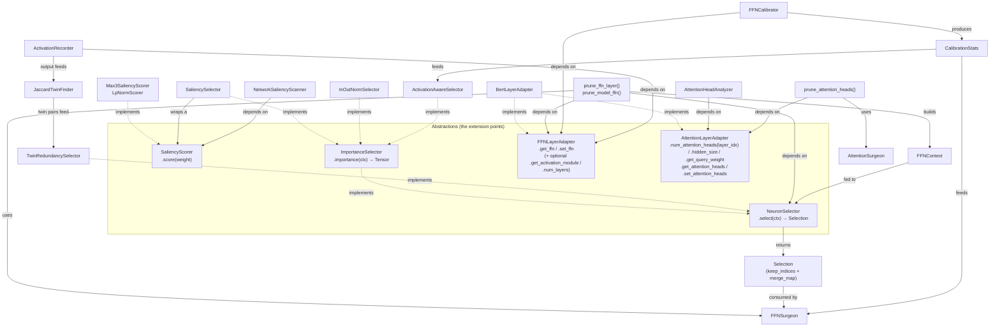

# Knowledge Transfer: `transformer_pruning`

Audience: a developer/researcher picking up this codebase for the first time —
either to run the existing experiments, extend them with a new pruning
criterion, or port the approach to a new model family.

This document goes deeper than the [README](../README.md): the README sells
the architecture in a paragraph each; this document explains *why* each piece
exists, what it depends on, what breaks if you change it, and how to extend
it safely.

---

## 1. What this project is

This project extends pruning criteria originally developed for CNNs (VGG/
ResNet, in the sibling thesis project `pruning_framwork_v4` — "Pruning and
Quantization Techniques for Deep Neural Network Acceleration", NITK, July
2025) onto transformer models, specifically BERT via HuggingFace
`transformers`.

It explores four independent pruning/redundancy signals:

1. **Weight-magnitude saliency** — score each neuron/filter from its
   incoming weights alone and prune the lowest scorers. The thesis's Max-3
   rule (sum of the 3 largest-magnitude incoming weights) lives here,
   generalized to any `k` and to `nn.Linear` (BERT's FFN layers), alongside
   the plain Lp-norm baseline it is meant to beat.
2. **Whole-neuron importance** — a neuron's actual contribution to the layer
   output is `W_out[:, i] * act(W_in[i] @ x + b_i)`, so incoming weights are
   only half of it. `InOutNormSelector` adds the outgoing projection;
   `ActivationAwareSelector` adds how hard the neuron actually fires on real
   data (which needs a calibration pass — see `calibration.py`).
3. **Attention-head redundancy** — cosine similarity / Lp-distance between
   attention heads' flattened query weights, to find near-duplicate heads
   (exploratory, feeds no automated pruning step yet — output is heatmaps for
   a human to read).
4. **Co-activation ("twin") redundancy** — a criterion *not* in the thesis:
   run real sentences through a trained model, record which FFN neurons fire
   together, and treat neurons with near-identical firing patterns (Jaccard/
   IoU ≥ 0.95) as redundant regardless of what their weights look like.

Criteria 1, 2 and 4 all terminate in the same physical operation: shrinking a
BERT FFN block's `(intermediate, output)` `nn.Linear` pair. That shared
endpoint is what the architecture (Section 4) is built around.

Two corrections sit on top of that shared endpoint, and they belong to the
surgery rather than to any one criterion, so every criterion gets them for
free:

- **Merging** — fold a removed neuron's output column into a surviving one
  instead of discarding it. This is what makes twin redundancy interesting:
  `JaccardTwinFinder` flags `j` precisely *because* it behaves like `i`.
- **Bias compensation** — add the removed neurons' expected contribution
  `W_out[:, j] * E[a_j]` back into the output bias. A constant is exactly
  what a bias can represent exactly, so the layer's mean output survives the
  cut and only the zero-mean residual is real damage.

A third axis is *where* the budget is spent. `prune_model_ffn` offers either
uniform allocation (every layer loses the same fraction) or global allocation
(every neuron in the model competes against every other). FFN redundancy is
not spread evenly across depth, so the two answers are not the same cut at
the same compression — which is what stage 11 measures.

`pruning_framwork_v4` and this repo share a research idea, not code —
different frameworks, different model families, different datasets. Don't go
looking for imports between them.

See `../pruning_framwork_v4/KNOWLEDGE_TRANSFER.md` for the CNN-side thesis
framework: its full pruning-criteria catalog with thesis chapter references,
the two bugs found/fixed there (K-means centroid init, distance-scorer
double-pruning) with from-scratch pure-Python verification code, and the
`config.ini`/Kaggle-validation-run plan.

---

## 2. Repository layout

```
transformer_pruning/
├── pruning_transformer/     # the importable package — all reusable logic
│   ├── __init__.py          # public API surface (what `from pruning_transformer import X` exposes)
│   ├── layers.py            # LayerHandle, LayerKind, discover_layers
│   ├── model_adapter.py     # FFNLayerAdapter, AttentionLayerAdapter, BertLayerAdapter
│   ├── context.py           # FFNContext, Selection — what a selector sees and returns
│   ├── calibration.py       # CalibrationStats, FFNCalibrator
│   ├── scoring.py           # SaliencyScorer, TopKMagnitudeScorer, Max3SaliencyScorer, LpNormScorer, CSDScorer, lowest_scoring
│   ├── network_scanner.py   # NetworkSaliencyScanner
│   ├── head_analysis.py     # AttentionHeadAnalyzer
│   ├── ffn_surgery.py       # FFNSurgeon
│   ├── attention_surgery.py # AttentionSurgeon
│   ├── selectors.py         # NeuronSelector, ImportanceSelector, SaliencySelector,
│   │                        #   InOutNormSelector, ActivationAwareSelector, TwinRedundancySelector,
│   │                        #   WeightClusterRedundancySelector
│   ├── clustering.py        # kmeans_assign (from-scratch k-means, no external ML dependency)
│   ├── pruning_workflow.py  # prune_ffn_layer, prune_model_ffn, prune_attention_heads (the orchestration entry points)
│   ├── activation_recording.py  # ActivationRecorder
│   └── redundancy.py        # JaccardTwinFinder
├── experiments/              # 11 runnable scripts, one per exploration stage
│   ├── _mrpc.py              # shared MRPC harness for the training experiments (05/09/10/11)
│   ├── 01_vgg_saliency_demo.py
│   ├── ...
│   └── 11_global_multilayer_pruning.py
├── tests/                    # 110 pytest tests — torch only, no GPU, no HuggingFace
│   ├── conftest.py           # StubBert: a BERT-shaped module tree built by hand
│   └── test_*.py             # one file per package module (layers.py is covered in test_network_scanner.py)
├── docs/
│   └── KNOWLEDGE_TRANSFER.md  # this file
├── README.md
├── pyproject.toml            # package deps + [experiments] / [dev] extras
├── requirements.txt
└── .gitignore
```

Rule of thumb: **`pruning_transformer/` never imports from `experiments/`**,
and every experiment script only imports from `pruning_transformer` (plus
third-party libraries). If you find yourself importing an experiment script
from inside the package, that logic belongs in the package instead.

`experiments/_mrpc.py` is the one deliberate exception to "no cross-imports
between experiment scripts": stages 05, 09, 10 and 11 import it. It is shared
*experiment* scaffolding (dataset, metric, Trainer factory), not reusable
library logic, which is exactly why it lives under `experiments/` and not in
the package. See Section 7 for why it had to exist.

---

## 3. Environment & running

There is **no GPU on the primary dev machine** for this project (same
constraint as `pruning_framwork_v4`) — the experiment scripts are meant to be
run on Colab/Kaggle, not locally.

That restriction applies to the *experiments*, not to the library. A CPU-only
torch build does install on the dev machine, and the test suite runs there in
under a second (see "Running the tests" below):

```bash
python3 -m venv venv
./venv/bin/pip install --index-url https://download.pytorch.org/whl/cpu torch
./venv/bin/pip install pytest numpy pandas
```

Setup on a machine/notebook that will also run the experiments:

```bash
pip install -e ".[experiments]"     # or: pip install -r requirements.txt
```

The package itself depends only on torch/numpy/pandas. Everything
HuggingFace-shaped (`transformers`, `datasets`, `evaluate`, `accelerate`) and
everything plotting-shaped is in the `[experiments]` extra, because none of it
is needed to import or test the library. Note the lower bound
`transformers>=4.46`: the experiment scripts pass `eval_strategy` to
`TrainingArguments`, which earlier releases spell `evaluation_strategy`.

Run any experiment directly:

```bash
python experiments/05_bert_mrpc_full_experiment.py
```

### Running the tests

```bash
pip install -e ".[dev]" && pytest
```

110 tests, roughly half a second, **no GPU and no `transformers`/`datasets`
required** — torch is the only real dependency. `tests/conftest.py` builds
`StubBert`, a BERT-shaped `nn.Module` tree by hand, because the adapters only
need the `encoder.layer[i]` *shape*, not HuggingFace itself. The side benefit
is that pathological cases a real checkpoint would never produce — dead
neurons, exact twins, fp16 weights, a biasless FFN — are trivial to construct.

This is the check to run before pushing any change to the package. It
verifies the *mechanics* (shapes, dtypes, index validation, arithmetic
identities like "merging two identical neurons preserves the layer output").
It does not and cannot verify the research claims; only a real run on
Colab/Kaggle does that.

**Status caveat (from the README):** the experiment scripts were
extracted/cleaned from an exploratory Colab notebook and have **not** been run
end-to-end in *this* repo's layout — treat any printed accuracy result as
needing a real run before citing it anywhere. The test suite does not change
this: it covers the mechanics, not the numbers. One correctness fix was made
during extraction: the original notebook's twin-finder computed
`intersection / (fires_A + fires_B)`, which is off by a factor vs. true
Jaccard/IoU (`intersection / union`, where
`union = fires_A + fires_B - intersection`). `redundancy.py`'s
`JaccardTwinFinder` uses the corrected formula — twin-pair counts will differ
slightly from the original notebook's printed output.

---

## 4. Architecture

The package is built around **five small interfaces** so that adding a new
pruning criterion, a new attention metric, a new prunable layer type, or
support for a new model family never means editing existing scanning,
surgery, or orchestration code.



### The five interfaces

| Interface | File | Contract | Implementations | Consumers |
|---|---|---|---|---|
| `SaliencyScorer` | `scoring.py` | `score(weight) -> Tensor` (one score per output unit) | `TopKMagnitudeScorer` (`Max3SaliencyScorer`), `LpNormScorer` | `NetworkSaliencyScanner`, `SaliencySelector` |
| `NeuronSelector` | `selectors.py` | `select(ctx: FFNContext) -> Selection`; default implementation wraps `select_keep_indices(ctx) -> list` | `ImportanceSelector` subclasses, `TwinRedundancySelector` | `prune_ffn_layer` |
| `ImportanceSelector` | `selectors.py` | `importance(ctx: FFNContext) -> Tensor` (higher survives); inherits the budget arithmetic | `SaliencySelector`, `InOutNormSelector`, `ActivationAwareSelector` | `prune_model_ffn(allocation="global")` |
| `FFNLayerAdapter` | `model_adapter.py` | `get_ffn(layer_idx)`, `set_ffn(layer_idx, intermediate, output)`; optionally `get_activation_module(layer_idx)`, `num_layers()` | `BertLayerAdapter` | `prune_ffn_layer`, `prune_model_ffn`, `ActivationRecorder`, `FFNCalibrator` |
| `AttentionLayerAdapter` | `model_adapter.py` | `num_attention_heads(layer_idx)`, `hidden_size`, `get_query_weight(layer_idx)`, `get_attention_heads(layer_idx)`, `set_attention_heads(layer_idx, query, key, value, output, num_heads)` | `BertLayerAdapter` | `AttentionHeadAnalyzer`, `prune_attention_heads` |

Two plain data carriers travel between them, both in `context.py`:

- **`FFNContext`** is everything a selector is allowed to look at: both weight
  matrices, both biases, the optional `CalibrationStats`, and the layer index.
  It replaced a bare `intermediate.weight` argument, which structurally
  limited every criterion to half the neuron (see Section 5's `context.py`
  entry). Widening it to an object means the *next* criterion that needs a new
  input is a new field, not a signature change rippling through every existing
  selector.
- **`Selection`** is everything a selector is allowed to ask surgery for:
  `keep_indices`, plus an optional `merge_map` of `dropped -> (survivor,
  scale)`. `Selection.of(...)` normalises and validates — it sorts and
  de-duplicates the keep list (surgery slices with it, so its order silently
  becomes the new neuron order), rejects out-of-range indices, rejects an
  empty selection, and rejects a `merge_map` whose survivor is itself being
  dropped.

`TransformerLayerAdapter` (also in `model_adapter.py`) is just
`FFNLayerAdapter + AttentionLayerAdapter` combined — a convenience type for
`BertLayerAdapter`, which happens to support both. **New consumers should
depend on whichever single interface they actually need**, not the combined
one — that's the whole point of the split (see Section 4.1).

### 4.1 Why it's shaped this way (SOLID, with concrete pointers)

This codebase was deliberately refactored (across several review passes) to
satisfy SOLID, replacing an earlier version with near-duplicate classes
(`SaliencyPruner`/`UniversalPruner`, `SimilarityScanner`/
`DistributionScanner`, a `CoActivationScanner` that mixed recording with
analysis, etc. — see Section 9 for the full old-name → new-location map).
Concretely, in this codebase:

- **Single Responsibility** — `activation_recording.py` only records which
  neurons fired; `redundancy.py` only decides which fired-together pairs
  count as "twins". The original notebook's `CoActivationScanner` did both,
  so changing the redundancy threshold logic risked also touching the
  recording/hooking mechanics. Now they change independently. The same split
  is why `calibration.py` exists separately from `activation_recording.py`
  despite both hooking the same module: one keeps running moments, the other
  keeps the full per-token pattern, and they are answering different
  questions.
- **Open/Closed** — four concrete examples:
  - `layers.py`'s `discover_layers` recognizes new module types via a
    `LayerKind(name, module_type, name_filter)` passed through `extra_kinds`,
    not via editing an `if/elif` chain. Adding `nn.LayerNorm` support is
    `discover_layers(model, extra_kinds=[LayerKind("layernorm", nn.LayerNorm)])`
    — zero edits to `layers.py`.
  - `head_analysis.py`'s `compute_distance_matrix` looks up the Lp-norm order
    from a `LP_METRICS` dict (`{"manhattan": 1, "euclidean": 2}`) instead of
    an `if metric == "manhattan" else ...` ternary. A third metric is a new
    dict entry; an unrecognized metric raises `ValueError` instead of
    silently defaulting to Euclidean.
  - `FFNContext` is the OCP fix applied to a signature rather than a branch.
    Selectors used to take a bare weight tensor; adding a criterion that
    needed the output projection would have meant changing that parameter
    everywhere. Now it is a field on a context object, and the criteria that
    don't care never notice.
  - `ImportanceSelector` holds the keep-count arithmetic (`n_keep`,
    `prune_percent` validation, the `min_keep` floor) once, so a new scoring
    criterion is a single `importance(ctx)` method — not a re-derivation of a
    rounding rule that has already been got wrong once (Section 10.1, bug 6).
- **Liskov Substitution** — every selector is interchangeable wherever a
  `NeuronSelector` is expected; `prune_ffn_layer` (`pruning_workflow.py`)
  never branches on which one it got. The one place that *does* discriminate
  is honest about it: `prune_model_ffn(allocation="global")` requires an
  `ImportanceSelector`, because ranking neurons across layers needs a scalar
  score per neuron and a purely structural criterion has none to give. That
  is a genuine capability requirement expressed as a narrower type, checked up
  front with an explanation, not a hidden `isinstance` branch that changes
  behaviour.
- **Interface Segregation** — `model_adapter.py`'s adapter interface used to
  be one fat `TransformerLayerAdapter` with 5 abstract members covering both
  FFN and attention access. It was split into `FFNLayerAdapter` and
  `AttentionLayerAdapter` because no consumer used both halves
  (pruning/recording only touch FFN; `AttentionHeadAnalyzer` only touches
  attention). The same reasoning is why `get_activation_module` and
  `num_layers` were added to `FFNLayerAdapter` as **non-abstract** methods
  whose default body raises a `NotImplementedError` explaining what to
  override: only calibration/recording need the first and only
  `prune_model_ffn` needs the second, so an adapter written purely to enable
  weight-based single-layer pruning is not forced to stub out either.
- **Dependency Inversion** — `prune_ffn_layer`, `AttentionHeadAnalyzer`,
  `ActivationRecorder`, and now `FFNCalibrator` used to (or would otherwise)
  reach directly into `model.encoder.layer[i].intermediate.dense` /
  `...attention.self.query...` — i.e., high-level orchestration depending on
  one concrete HuggingFace model's attribute layout. They depend on the
  adapter interfaces instead; `BertLayerAdapter` is the only implementation,
  but a differently shaped architecture is a new adapter class, not an edit to
  four separate consumers.

### 4.2 What's *not* abstracted, on purpose

Not every class has an interface, and that's intentional — don't "fix" these
without a concrete reason:

- **`FFNSurgeon`** (`ffn_surgery.py`) is a concrete class, not an ABC with
  multiple implementations. Given a `Selection`, there is exactly one correct
  way to physically resize an `(intermediate, output)` Linear pair — it's a
  mechanical operation, not a policy decision, so there's nothing to swap.
  Note that merging and bias compensation did *not* change this: they are
  extra mechanics the surgeon performs on instruction, not alternative
  policies. The policy (which neurons, merged into which) is entirely in the
  `Selection` the selector produced.
- **`AttentionSurgeon`** (`attention_surgery.py`) is likewise a concrete
  class: given a layer's Q/K/V/output Linears, a head count, and which heads
  to drop, there is exactly one correct row/column slice. It takes bare
  Linears rather than an adapter, the same separation `FFNSurgeon` keeps —
  the adapter's job (`set_attention_heads`) is installing the result back
  onto the model *and* keeping the model's own head-count bookkeeping
  consistent, which is model-layout-specific in a way tensor slicing is not.
- **`FFNContext` / `Selection` / `CalibrationStats`** are frozen dataclasses,
  not interfaces. They are data crossing a boundary; there is no behaviour to
  vary.
- **`AttentionHeadAnalyzer`** bundles cosine similarity *and* Lp-distance in
  one class rather than two, because both share the same `get_flat_heads`
  extraction step; splitting them would mean either duplicating that
  extraction or introducing a shared base class for two methods — not worth
  it for two closely related, rarely-changing computations.
- **BERT-only model coverage**: only `BertLayerAdapter` exists. The interface
  split (4.1) makes adding a second adapter (e.g. for a model with a
  differently-shaped FFN block) straightforward *if and when* one is
  actually needed — don't pre-build a `DistilBertLayerAdapter` speculatively.

---

## 5. Module-by-module reference

### `layers.py`
- `LayerHandle(name, module, kind)` — a dataclass wrapping a discovered
  module with its qualified name and a `kind` tag (`"conv2d"`, `"linear"`,
  or whatever a custom `LayerKind` names it).
- `LayerKind(name, module_type, name_filter=None)` — a frozen dataclass
  describing one recognizable module type. `name_filter`, if set, requires
  the module's qualified name to contain that substring (used to isolate
  BERT's `intermediate` FFN-expansion Linears from all other Linears).
- `discover_layers(model, include_conv=True, include_linear=False, linear_name_filter=None, extra_kinds=())`
  — walks `model.named_modules()` and returns matching `LayerHandle`s. The
  built-in conv/linear kinds are gated by `include_conv`/`include_linear`;
  anything else goes through `extra_kinds`.

### `model_adapter.py`
- `FFNLayerAdapter` (ABC) — abstract: `get_ffn(layer_idx) -> (intermediate,
  output)`, `set_ffn(layer_idx, intermediate, output) -> None`. Non-abstract,
  with self-explaining `NotImplementedError` defaults (see the ISP bullet in
  4.1):
  - `get_activation_module(layer_idx)` — the module whose output is the
    **post-activation** FFN hidden tensor, i.e. exactly what the output
    projection consumes. For BERT that is `encoder.layer[i].intermediate`
    (a `BertIntermediate` = dense + activation), **not**
    `encoder.layer[i].intermediate.dense`, whose output is pre-activation.
    The distinction is invisible for sign-based firing detection (GELU and
    ReLU are both positive exactly where their input is) and fatal for any
    magnitude statistic — which is why calibration hooks here and why this
    is not simply `get_ffn(...)[0]`.
  - `num_layers()` — only `prune_model_ffn` needs it, and only when
    `layer_indices` is not given explicitly.
- `AttentionLayerAdapter` (ABC) — `num_attention_heads(layer_idx)` (a
  per-layer *method*, not a model-wide property: `attention_surgery` can
  shrink one layer's head count independently of the others, and
  `BertLayerAdapter` reads it straight off that layer's own self-attention
  module rather than the shared `config.num_attention_heads`), `hidden_size`
  (property), `get_query_weight(layer_idx)`, `get_attention_heads(layer_idx)
  -> (query, key, value, output)`, `set_attention_heads(layer_idx, query,
  key, value, output, num_heads)`.
- `TransformerLayerAdapter` — `FFNLayerAdapter + AttentionLayerAdapter`,
  nothing added on top. Only exists so `BertLayerAdapter` has one type name
  to inherit that satisfies both.
- `BertLayerAdapter(model)` — the only concrete adapter. Assumes
  `model.encoder.layer[i]` layout (HuggingFace `BertModel`; also correct for
  `RobertaModel`, which shares that layout).

### `context.py`
- `FFNContext(intermediate_weight, output_weight, intermediate_bias=None, output_bias=None, stats=None, layer_index=None)`
  — the read-only view a selector gets. **Why it exists:** selectors used to
  receive a bare `intermediate.weight`, which is structurally half a neuron —
  what a neuron actually contributes is `W_out[:, i] * act(W_in[i] @ x + b_i)`,
  so a `W_in`-only criterion cannot see a neuron whose output column is dead.
  It hands out the live parameter tensors and **nothing that consumes it may
  mutate them**; resizing is the surgeon's job alone.
  - `.num_neurons` — `intermediate_weight.shape[0]`.
  - `.require_stats(criterion_name)` — returns `stats`, or raises naming the
    step the caller skipped (rather than surfacing later as
    `AttributeError: 'NoneType'`). Also catches stats whose neuron count
    doesn't match the layer — usually stats collected against a different
    layer, or against this one *before* an earlier pruning pass.
  - `.from_layers(intermediate, output, stats=None, layer_index=None)` —
    build one from a live Linear pair. This is what `prune_ffn_layer` calls.
- `Selection(keep_indices, merge_map=None)` — what a selector returns.
  `merge_map` maps a dropped neuron to `(survivor, scale)`; surgery adds
  `scale * W_out[:, dropped]` onto `W_out[:, survivor]`. `keep_indices` alone
  forces every criterion into the same crude move — delete the loser — which
  is exactly wrong for a redundancy criterion, where the dropped neuron's
  contribution is signal its twin can carry.
  - `Selection.of(keep_indices, merge_map=None, num_neurons=None)` — the
    normalising constructor; see Section 4's data-carrier notes for what it
    validates. Use it rather than the raw constructor.

### `calibration.py`
- `CalibrationStats(mean, mean_abs, rms, tokens)` — per-neuron activation
  moments over a calibration corpus. `mean` is the *signed* expectation
  `E[a_i]`, which is what bias compensation needs (what pruning removes is
  `W_out[:, i] * a_i`, and its expectation is `W_out[:, i] * E[a_i]`).
  `mean_abs`/`rms` are unsigned magnitude measures for importance scoring,
  where a neuron swinging hard in both directions matters even though its
  signed mean is near zero.
  - `.to(...)` — move/cast the three vectors, like `Tensor.to`.
  - `.select(indices)` — restrict to a subset of neurons, keeping `tokens`.
    Needed when stats collected *before* surgery are reused against the
    resized layer afterwards.
- `FFNCalibrator(model, adapter=None).collect(batches, layer_idx, max_batches=None)`
  — hooks `adapter.get_activation_module(layer_idx)`, runs `batches` (any
  iterable of kwarg dicts ready to splat into the model, e.g. what a
  HuggingFace `DataCollatorWithPadding` yields), and returns
  `CalibrationStats`. Three things worth knowing:
  - It **streams**: one `(neurons,)` reduction per batch, so calibrating on a
    large corpus never materialises the full `(tokens, neurons)` tensor.
  - Accumulation is **float64 on CPU** while the per-batch reduction stays in
    the model's dtype on-device — a long corpus can't drift the way a float32
    (or worse, float16) running sum would.
  - Padding is **masked** via `attention_mask` if present. Counting `[PAD]`
    positions would drag every mean toward whatever the model happens to emit
    there, which is an artifact of batching, not a property of the data.
  - Restores `model.training` and removes the hook in a `finally`; raises if
    it saw no tokens at all.

  Contrast with `ActivationRecorder`: both hook the same module, but the
  recorder deliberately keeps the full per-token pattern because
  `JaccardTwinFinder` compares *which tokens* two neurons fired on —
  information no summary statistic preserves. The calibrator throws per-token
  detail away because nothing downstream of it needs more than a mean.

### `scoring.py`
- `SaliencyScorer` (ABC) — `score(weight) -> Tensor`, one score per output
  unit (`weight.shape[0]`). Scorers see only *one* weight tensor, so they can
  only ever express weight-magnitude criteria; anything needing the output
  projection or activations is a `NeuronSelector` instead (that boundary is
  the reason both abstractions exist).
- `TopKMagnitudeScorer(k=3)` — per output unit, sums its `k` largest-magnitude
  incoming weights. Conv and linear share one code path via `_as_groups`,
  which reshapes any weight to `(out_units, group, position)`: a 2D linear
  weight `(out, in)` becomes `(out, 1, in)`, a 4D conv weight becomes
  `(out, in_ch, kh*kw)`. Rejects rank < 2.
- `Max3SaliencyScorer` — the thesis's Max-3 criterion, i.e.
  `TopKMagnitudeScorer(k=3)`. Kept as a named class because that is the name
  the thesis uses.
- `LpNormScorer(p=2.0)` — the standard magnitude baseline Max-3 is meant to
  beat, kept here so one scanner can report both rather than an experiment
  hand-rolling the comparison.
- `CSDScorer` — per output unit, `sum(|w - mean(w)|)`: dispersion from the
  row's own mean, not magnitude. Adapted from the "Custom Standard
  Deviation" training-time regularizer in Thaker & Mohan, *"Enhancing Deep
  Compression of CNNs"* (IEEE Access, 2024, `L1Norm/CSD` loss), used here
  directly as a one-shot post-hoc score instead — no retraining pass
  required. A near-uniform row is nearly a constant/bias regardless of
  input; high dispersion means the unit actually discriminates.
- `lowest_scoring(scorer, weight, amount)` — convenience free function: the
  `amount` lowest-scoring unit indices + their scores, as `[index, score]`
  pairs. Used for one-off single-layer lookups (see `experiments/01`).

### `network_scanner.py`
- `NetworkSaliencyScanner(layers, scorer, cache=True)` — takes a list of
  `LayerHandle` and a `SaliencyScorer` as constructor dependencies (this is
  the DIP example: the *same* class handles a pure-CNN pass over VGG16 and a
  mixed Conv2d+Linear pass over BERT, just by being handed a different
  `layers` list — see `experiments/02` vs `experiments/03`).
  - `.scan()` → a `pandas.DataFrame` with one row per layer: Layer, Type,
    Units, Avg/Min/StdDev score.
  - `.weakest_units(layer_name, n=5)` → the `n` lowest-scoring unit indices
    for one named layer. Raises `ValueError` naming known layers if the name
    isn't among the scanned ones.
  - Scores are **cached per layer name**, because `scan()` followed by
    `weakest_units()` on the same layer otherwise pays for a full pass over
    the weights twice. Pass `cache=False`, or call `.invalidate()`, if you
    mutate weights between calls (after pruning or fine-tuning).

### `head_analysis.py`
- `LP_METRICS = {"manhattan": 1, "euclidean": 2}` — module-level dict, the
  OCP extension point for distance metrics.
- `AttentionHeadAnalyzer(model=None, adapter=None)` — pass either a raw
  HuggingFace model (wrapped in `BertLayerAdapter` automatically) or a
  pre-built `AttentionLayerAdapter`. Raises `ValueError` if neither is given.
  - `.get_flat_heads(layer_idx)` → `(num_heads, head_dim * hidden_size)`-shaped
    tensor of each head's flattened query weights, where `num_heads` and
    `head_dim` come from the *layer's own* query weight shape and
    `adapter.num_attention_heads(layer_idx)` — not the model's global
    `hidden_size` — so this stays correct on a layer
    `attention_surgery.prune_attention_heads` has already resized. Raises if
    the query weight's output size isn't divisible by `num_attention_heads`.
  - `.compute_similarity(layer_idx)` → cosine similarity matrix (heads
    unit-normalized first).
  - `.compute_distance_matrix(layer_idx, metric="manhattan", normalize=False)`
    → Lp-distance matrix; `normalize=True` unit-normalizes heads first to
    isolate directional (vs. magnitude) redundancy. Raises `ValueError` on
    an unrecognized `metric`.

### `ffn_surgery.py`
- `FFNSurgeon.resize(intermediate, output, selection, stats=None, compensate_bias=False)`
  — builds fresh `nn.Linear` modules containing only the selected neurons,
  copies weights/biases under `torch.no_grad()`, and returns
  `(new_intermediate, new_output)`. **Does not mutate the model in place** —
  the caller (`prune_ffn_layer`) re-attaches the returned modules via the
  adapter. `selection` may be a `Selection` or a plain list of indices.
  What it guarantees:
  - **Validation.** Out-of-range and empty selections, a `merge_map` pointing
    at a non-surviving survivor, stats whose neuron count doesn't match, and
    an inconsistent FFN pair (`output.weight.shape[1] != num_neurons`, i.e.
    an adapter returning two Linears that aren't actually paired) all raise
    with an explanation naming the likely cause.
  - **dtype preservation.** The new Linears are constructed with the
    originals' dtype and device. A bare `nn.Linear` defaults to float32,
    which silently converted a half-precision model into one fp32 layer that
    then mismatched every other layer at forward time.
  - **`requires_grad` preservation.** A frozen layer stays frozen across
    surgery — otherwise a "heal" fine-tune quietly starts training weights
    the experiment meant to hold fixed.
  - **`bias=None` support**, on either Linear.
  - **Merging.** Applied from `selection.merge_map`, always reading from a
    clone of the *original* columns, so two neurons merging into the same
    survivor (or a chain of merges) can't make the result depend on dict
    iteration order.
  - **Bias compensation.** With `compensate_bias=True` (requires `stats` and
    an output bias, both checked), adds each removed neuron's expected
    contribution `W_out[:, j] * E[a_j]` into the output bias. For a neuron
    merged into `i` with scale `s`, the merge already reintroduces
    `s * W_out[:, j] * a_i`, so only the residual
    `W_out[:, j] * (E[a_j] - s*E[a_i])` is added — zero exactly when the
    scale was `E[a_j]/E[a_i]`. Handling both in one expression is what keeps
    merge and compensation from double-counting each other.

### `attention_surgery.py`
- `AttentionSurgeon.resize(query, key, value, output, num_heads, head_indices)`
  — the attention-block counterpart to `FFNSurgeon.resize`. `query`/`key`/
  `value` are `(hidden, hidden)` Linears whose *output* rows partition into
  `num_heads` head-sized blocks (HuggingFace's layout: head `h` owns rows
  `[h*head_dim, (h+1)*head_dim)`); `output` is the attention block's output
  projection, whose *input* columns partition the same way, since its input
  is the heads' concatenated context vectors. Returns
  `(new_query, new_key, new_value, new_output, new_num_heads)` — like
  `FFNSurgeon`, it does not mutate the model in place; the caller
  (`prune_attention_heads`) re-attaches the result via the adapter.
  - **No merge, no bias compensation.** A dropped head's contribution is a
    function of the input (its attention pattern over the sequence), not a
    per-neuron constant a bias term can absorb, so there is no cheap
    correction to apply here the way there is for a dropped FFN neuron.
  - **Which heads to drop is not this class's decision.** `head_indices` comes
    from the caller — `AttentionHeadAnalyzer`'s similarity/distance matrices
    are one candidate signal, but query-weight cosine similarity is a known
    weak one (two heads with similar Q but different V do different jobs);
    see `docs/CHANGELOG.md`'s "Deferred" section under 0.2.0.
  - **Validation** mirrors `FFNSurgeon`'s: out-of-range head indices,
    removing every head, `num_heads` not dividing the Q/K/V output size, and
    an inconsistent Q/K/V/output quartet all raise with an explanation.
  - **dtype/device/`requires_grad` preservation** and `bias=None` support,
    same guarantees as `FFNSurgeon`. The output projection's *bias* is left
    untouched by construction — it's indexed by hidden size, not head, so no
    head removal ever needs to touch it.

### `selectors.py`
- `NeuronSelector` (ABC) — `select(ctx: FFNContext) -> Selection` is the
  primary contract, with a default implementation that wraps
  `select_keep_indices(ctx) -> list` in `Selection.of(...)`. **Subclasses
  normally implement `select_keep_indices`**; override `select` only when the
  criterion needs to express merges, as `TwinRedundancySelector` does.
- `ImportanceSelector(prune_percent, min_keep=1)` — the base class for every
  "score each neuron, keep the best" rule. Subclasses implement
  `importance(ctx) -> Tensor` (higher survives) and inherit:
  - `prune_percent` validation (must be in `[0, 100)` — 100 would delete the
    layer),
  - `n_keep(num_neurons)`, which **rounds** rather than truncating (see
    Section 10.1, bug 6) and applies the `min_keep` floor,
  - the top-k itself.
- `SaliencySelector(scorer, prune_percent, min_keep=1)` — importance is the
  given `SaliencyScorer` over `ctx.intermediate_weight`. Incoming weights
  only.
- `InOutNormSelector(prune_percent, p=2.0, min_keep=1)` — importance is
  `||W_in[i]||_p * ||W_out[:, i]||_p`. The **product** form is the point: a
  neuron is only useful if it is both driven by its input *and* read by the
  output projection, so a near-zero factor on either side should sink it,
  where a sum would let a large input norm mask a dead output column. Note
  `W_out` is `(hidden, neurons)`, so a neuron's outgoing weights are a
  *column* — that norm runs down dim 0.
- `ActivationAwareSelector(prune_percent, p=2.0, statistic="mean_abs", min_keep=1)`
  — importance is `||W_out[:, i]||_p * E[|a_i|]`. Weight-only criteria measure
  capacity; this measures use. A neuron can be strongly wired and near-useless
  because it barely fires on the target distribution — common in a fine-tuned
  model, where the pretrained FFN carries capacity the downstream task never
  exercises. **Requires calibration** (raises via `ctx.require_stats` if
  `stats` is `None`). `statistic` is `"mean_abs"` (average contribution
  magnitude) or `"rms"` (weights occasional large excursions more heavily).
- `TwinRedundancySelector(twin_pairs, merge=False)` — drops the higher-indexed
  neuron of every `(a, b, similarity)` twin tuple from `JaccardTwinFinder`.
  - **Chains resolve transitively** via union-find at construction time:
    given twins `(i, j)` and `(j, k)`, `k` is merged into `i`, not into the
    already-doomed `j`.
  - With `merge=True` it emits a `merge_map` so the dropped twin's output
    column is folded into its survivor rather than discarded — if `a_j ≈ a_i`
    then `W_out[:, j] * a_j ≈ W_out[:, j] * a_i`, so adding `W_out[:, j]` onto
    `W_out[:, i]` reproduces the removed contribution. The scale is
    `E[a_j] / E[a_i]` from calibration when available, and **1.0 otherwise**
    — which is also the fallback when the denominator is near zero. That guard
    matters: a GELU neuron's *signed* mean can sit near zero while the neuron
    is highly active, and an unguarded ratio would then blow the merged column
    up by orders of magnitude, turning a conservative merge into a worse
    perturbation than the plain drop it replaced.
  - **Ignores weight magnitudes entirely** (it reads `ctx.num_neurons`, and
    `ctx.stats` when merging) — correct, not a bug: the signal here is
    behavioral. It still takes the same `FFNContext` as every other selector
    to stay substitutable (LSP).
- `WeightClusterRedundancySelector(prune_percent, min_keep=1, merge=False, kmeans_iters=50, seed=0)`
  — the weight-space counterpart to `TwinRedundancySelector`: redundancy from
  what a neuron *is* (its `W_in` direction) rather than how it behaves on
  real data, so it needs no activation corpus. Adapted from the K-Means
  channel-selection method in Thaker & Mohan, *"Channel Pruning of Transfer
  Learning Models Using Novel Techniques"* (IEEE Access, 2024): cluster
  channels by weight similarity, keep the highest-L1-norm channel per
  cluster. That paper had to condense a 2D conv kernel into a per-channel
  feature vector first (their Equation 1); a BERT FFN neuron's `W_in` row
  already *is* that feature vector, so no condensing step exists here.
  - Rows are L2-normalized before clustering (`clustering.kmeans_assign`),
    unlike the source paper — clusters form on weight *direction*, not
    magnitude, so a neuron pointed the same way as another is a redundancy
    candidate even if it fires much louder. `merge=True` compensates for
    that magnitude gap with the same calibration-derived scale
    `TwinRedundancySelector` uses (`_merge_scale`, shared module-level
    function).
  - `prune_percent`/`min_keep` share `ImportanceSelector`'s exact budget
    arithmetic (`_keep_count`, `_validate_budget` — extracted to module level
    so the two don't duplicate the rounding rule from Section 10.1 bug 6).
    It is a plain `NeuronSelector`, not an `ImportanceSelector`: cluster
    membership isn't a per-neuron scalar, so it works with
    `allocation="uniform"` but not `prune_model_ffn(allocation="global")`,
    same as `TwinRedundancySelector`.

### `clustering.py`
- `kmeans_assign(x, k, iters=50, seed=0)` — from-scratch Lloyd's-algorithm
  k-means, pure torch, no external ML dependency (the package depends only
  on torch/numpy/pandas — see Section 3). Returns a `(n,)` LongTensor of
  cluster ids. Centroids are seeded from a seeded `torch.randperm`, so
  results are reproducible independent of any global RNG state that the
  caller (or a prior test) may have left behind. An empty cluster keeps its
  previous centroid rather than being reseeded — a from-scratch k-means is
  the deliberately simple half of `WeightClusterRedundancySelector`; the
  policy of "which representative survives a cluster" belongs to the
  selector (Section 4.2's reasoning for why `FFNSurgeon` stays a concrete
  class applies here too — there's one correct way to run Lloyd's algorithm,
  so it isn't behind an interface).

### `pruning_workflow.py`
- `prune_ffn_layer(model, layer_index, selector, surgeon=None, adapter=None, stats=None, compensate_bias=False)`
  — one layer. Defaults `surgeon` to a fresh `FFNSurgeon()` and `adapter` to
  `BertLayerAdapter(model)`. Builds the `FFNContext`, asks the selector for a
  `Selection`, hands it to the surgeon, re-attaches via the adapter, returns
  the number of neurons kept.
- `prune_model_ffn(model, selector, layer_indices=None, allocation="uniform", surgeon=None, adapter=None, stats_by_layer=None, compensate_bias=False, normalize="mean", min_keep_ratio=0.1)`
  — the whole stack; returns `{layer_index: n_kept}`. `layer_indices` defaults
  to `range(adapter.num_layers())`; `stats_by_layer` is a
  `{layer_index: CalibrationStats}` dict.
  - `allocation="uniform"` just applies the selector per layer — each layer
    loses the selector's own `prune_percent`.
  - `allocation="global"` treats `prune_percent` as a *model-wide* budget:
    every neuron in every layer is scored, ranked together, and the globally
    weakest are removed. Requires an `ImportanceSelector` (rejected with an
    explanation otherwise — see the LSP bullet in 4.1).

  Three decisions inside global mode are worth understanding before you change
  anything there:
  - **Per-layer normalisation is not optional cosmetics.** Raw scores across
    layers aren't comparable — different layers have different weight scales —
    and ranking them directly tends to delete whichever layer has the smallest
    weight scale, wholesale, rather than finding the genuinely redundant
    neurons. `normalize="mean"` (default) divides each layer's scores by their
    mean, `"median"` is the outlier-resistant variant, `"none"` is for a
    criterion that is already scale-free. A layer whose scale is zero or
    non-finite is left unnormalised rather than turned into NaNs that would
    poison the whole ranking.
  - **Exact global top-k, not thresholding.** Selecting by
    `scores >= kth_score` keeps every tie *at* the threshold in full, so a
    model with many equal scores (a uniformly weighted layer, a block of exact
    zeros) silently keeps more neurons than the budget asked for.
  - **Score the whole model up front, before any surgery.** Scoring lazily
    inside the resize loop would rank later layers against a model earlier
    cuts had already mutated.

  `min_keep_ratio` (default 0.1) floors how much of any single layer the
  global verdict may take; a layer hit harder than the floor keeps its own
  strongest `floor` neurons instead. This deliberately spends slightly more
  than the budget rather than let a ranking artifact collapse a layer — so
  total compression can come in under the nominal `prune_percent`, and the
  returned `{layer: n_kept}` dict is the honest record of what happened.
- `prune_attention_heads(model, layer_index, head_indices, surgeon=None, adapter=None)`
  — one layer's attention block. Defaults `surgeon` to a fresh
  `AttentionSurgeon()` and `adapter` to `BertLayerAdapter(model)`. Unlike FFN
  pruning there is no selector: which heads to remove is a criterion
  `AttentionHeadAnalyzer` informs but does not decide by itself (see the
  open question in Section 10.1's "Deferred"), so the caller passes
  `head_indices` directly. Fetches the layer's Q/K/V/output via
  `adapter.get_attention_heads`, resizes, and re-attaches via
  `adapter.set_attention_heads` — which also updates the layer's own
  `num_attention_heads`/`attention_head_size`/`all_head_size`, the
  bookkeeping `BertSelfAttention.forward` actually reshapes Q/K/V by.
  Returns the number of heads kept. Which heads to pass in is still an open
  research question (`docs/CHANGELOG.md`'s "Deferred" section under 0.2.0);
  cosine similarity on raw query weight is one candidate signal, not the
  only defensible one.

### `activation_recording.py`
- `ActivationRecorder(model, tokenizer, adapter=None, batch_size=32, max_length=None)`
  — records a `(valid_tokens, neurons)` **bool** tensor: did neuron `j` fire
  on token `i`?
  - `.record(texts, layer_idx, batch_size=None, threshold=0.0)` — tokenizes
    and runs in batches.
  - `.record_batches(batches, layer_idx, threshold=0.0)` — for input that is
    already tokenized (e.g. from a HuggingFace collator), so a caller can
    reuse the exact batching their evaluation uses.
  - Hooks `adapter.get_activation_module(layer_idx)` — the post-activation
    module, not the intermediate `nn.Linear`.
  - **Padding is masked.** Keeping `[PAD]` rows made every neuron look
    co-active with every other on whatever the model emits there — enough to
    manufacture twin pairs that don't exist.
  - **Stateless across calls**: each call accumulates locally and returns; the
    returned tensor contains only that call's rows. The hook is always removed
    and `model.training` restored in a `finally`. Still **not thread-safe /
    not reentrant** — don't call `record()` concurrently on one instance;
    sequential reuse (same instance, different `layer_idx`) is fine.

### `redundancy.py`
- `JaccardTwinFinder.find(fires, threshold=0.95, max_pairs=None)` — takes the
  tensor `ActivationRecorder` produces (`(tokens, neurons)`, bool or float),
  computes pairwise true Jaccard/IoU (`intersection / union`, not the
  notebook's original off-by-factor formula — see Section 3), and returns
  `(twins, dead)`:
  - `twins`: `(i, j, overlap)` for pairs with `overlap >= threshold` and
    `i < j`, where both neurons actually fired, **sorted by descending
    overlap** so a caller taking the top-N takes the most redundant ones.
    `max_pairs` caps the list.
  - `dead`: neurons that never fired at all, found **directly from the firing
    counts**, not from the Jaccard matrix — they cannot be found there (see
    Section 10.1, bug 1). Reporting them separately also says the more useful
    thing: a dead neuron is unconditionally prunable, not merely redundant
    with some particular partner.
  - Fully vectorized: one matmul for the intersections, an upper-triangle
    mask, one host transfer for the whole result.

### `__init__.py`
Re-exports the full public API — everything a consumer needs is importable
directly as `from pruning_transformer import X`. If you add a new public
class/function, **add it here too** (both the `from .module import X` line
and the `__all__` entry) — nothing in `experiments/` should ever import from
a submodule path directly.

---

## 6. End-to-end usage patterns

### Max-3 saliency pruning (weight-based)

```python
from pruning_transformer import Max3SaliencyScorer, SaliencySelector, prune_ffn_layer

selector = SaliencySelector(Max3SaliencyScorer(), prune_percent=40)
kept = prune_ffn_layer(model.bert, layer_index=0, selector=selector)
```

### Calibrated, activation-aware pruning with bias compensation

```python
from pruning_transformer import ActivationAwareSelector, FFNCalibrator, prune_ffn_layer

stats = FFNCalibrator(model.bert).collect(batches, layer_idx=0)
kept = prune_ffn_layer(
    model.bert, layer_index=0,
    selector=ActivationAwareSelector(prune_percent=40),
    stats=stats, compensate_bias=True,
)
```

`batches` is any iterable of model-ready kwarg dicts — see
`MrpcHarness.calibration_batches` in `experiments/_mrpc.py` for one built from
a HuggingFace collator. The same `stats` object serves both the criterion and
the compensation; that is deliberate, it is one pass over the data.

### Co-activation twin pruning (behavior-based), with merging

```python
from pruning_transformer import (
    ActivationRecorder, FFNCalibrator, JaccardTwinFinder, TwinRedundancySelector, prune_ffn_layer,
)

fires = ActivationRecorder(model.bert, tokenizer).record(texts, layer_idx=0)
twins, dead = JaccardTwinFinder().find(fires, threshold=0.95)

stats = FFNCalibrator(model.bert).collect(batches, layer_idx=0)
kept = prune_ffn_layer(
    model.bert, layer_index=0,
    selector=TwinRedundancySelector(twins, merge=True),
    stats=stats, compensate_bias=True,
)
```

Note every flow calls the *exact same* `prune_ffn_layer` — the only thing that
changes is which `NeuronSelector` is constructed. This is the payoff of the
OCP/LSP design: adding a criterion means writing another `NeuronSelector`
subclass, never touching `prune_ffn_layer` or `FFNSurgeon`.

### Pruning the whole FFN stack, uniform vs. global

```python
from pruning_transformer import ActivationAwareSelector, FFNCalibrator, prune_model_ffn

calibrator = FFNCalibrator(model.bert)
stats_by_layer = {i: calibrator.collect(batches, layer_idx=i) for i in range(num_layers)}

kept = prune_model_ffn(
    model.bert, ActivationAwareSelector(prune_percent=40),
    allocation="global",          # or "uniform"
    stats_by_layer=stats_by_layer, compensate_bias=True,
)   # -> {0: 1420, 1: 1180, ...}
```

### Scanning a whole network (VGG or BERT)

```python
from pruning_transformer import discover_layers, Max3SaliencyScorer, NetworkSaliencyScanner

# VGG: conv layers only
layers = discover_layers(vgg_model, include_conv=True, include_linear=False)
# BERT: FFN-expansion Linears only
layers = discover_layers(bert_model, include_conv=False, include_linear=True, linear_name_filter="intermediate")

scanner = NetworkSaliencyScanner(layers, Max3SaliencyScorer())
report = scanner.scan()          # pandas DataFrame
weakest = scanner.weakest_units("features.24", n=5)
```

### Attention-head redundancy, and acting on it

```python
from pruning_transformer import AttentionHeadAnalyzer, prune_attention_heads

analyzer = AttentionHeadAnalyzer(model)   # BertLayerAdapter built automatically
sim = analyzer.compute_similarity(layer_idx=10)
dist = analyzer.compute_distance_matrix(layer_idx=10, metric="manhattan", normalize=True)

# analyzer only diagnoses; prune_attention_heads is the compression step,
# and takes head indices directly -- it does not pick a criterion for you.
redundant_heads = [c for r, c in zip(*(sim > 0.90).nonzero()) if r < c]
kept = prune_attention_heads(model, layer_index=10, head_indices=redundant_heads)
```

### Targeting a non-BERT model (extension example)

```python
from pruning_transformer import FFNLayerAdapter, prune_ffn_layer

class MyModelAdapter(FFNLayerAdapter):
    def get_ffn(self, layer_idx):
        block = my_model.blocks[layer_idx]
        return block.up_proj, block.down_proj

    def set_ffn(self, layer_idx, intermediate, output):
        block = my_model.blocks[layer_idx]
        block.up_proj, block.down_proj = intermediate, output

    # Only needed for calibration/recording:
    def get_activation_module(self, layer_idx):
        return my_model.blocks[layer_idx].act        # post-activation!

    # Only needed for prune_model_ffn without explicit layer_indices:
    def num_layers(self):
        return len(my_model.blocks)

prune_ffn_layer(my_model, layer_index=0, selector=selector, adapter=MyModelAdapter())
```

The last two methods are optional — leave them off if you only need
weight-based single-layer pruning, and the defaults will explain themselves if
something later does need them. No edits to `pruning_workflow.py`,
`ffn_surgery.py`, or any selector needed — this is the DIP payoff from
Section 4.1.

---

## 7. Experiments walkthrough

Each script under `experiments/` is a standalone, runnable exploration
stage — narrative order matters (each stage builds conceptually on the last)
but there's no code dependency between them; every script only imports from
`pruning_transformer` (plus `_mrpc.py`, below).

| # | Script | What it validates | Package pieces exercised |
|---|---|---|---|
| 01 | `01_vgg_saliency_demo.py` | Vectorized Max-3 score on one VGG16 conv layer | `Max3SaliencyScorer`, `lowest_scoring` |
| 02 | `02_vgg_network_scan.py` | Max-3 stats across all of VGG16 | `discover_layers`, `NetworkSaliencyScanner` |
| 03 | `03_bert_universal_scan.py` | Max-3 crossed over onto BERT-tiny's FFN layers | same scanner as 02, different `discover_layers` args |
| 04 | `04_bert_pruning_surgery_demo.py` | Neuron surgery doesn't break a forward pass | `SaliencySelector`, `prune_ffn_layer` |
| 05 | `05_bert_mrpc_full_experiment.py` | Real accuracy: four criteria compared from one shared trained baseline, on MRPC | `SaliencySelector`, `InOutNormSelector`, `ActivationAwareSelector`, `FFNCalibrator`, `compensate_bias` |
| 06 | `06_attention_head_similarity.py` | Cosine similarity between attention heads | `AttentionHeadAnalyzer.compute_similarity` |
| 07 | `07_attention_head_distance.py` | Manhattan vs. Euclidean head distance | `compute_distance_matrix`, both metrics |
| 08 | `08_attention_scaled_distribution.py` | Distance on unit-normalized heads (magnitude removed) | `compute_distance_matrix(..., normalize=True)` |
| 09 | `09_coactivation_twin_scan.py` | Behavior-based twin-neuron and dead-neuron detection | `ActivationRecorder`, `JaccardTwinFinder` |
| 10 | `10_twin_neuron_pruning_experiment.py` | Real accuracy: twins dropped vs. twins merged, identical compression | `TwinRedundancySelector(merge=...)`, `FFNCalibrator` |
| 11 | `11_global_multilayer_pruning.py` | Uniform vs. global allocation at equal total compression | `prune_model_ffn`, `ActivationAwareSelector` |

Stages 05, 10 and 11 are the "real experiment" scripts — they fine-tune,
measure damage, and re-heal. Everything else is a faster diagnostic/demo that
doesn't require training.

All three (plus stage 09, for its seeding) share `experiments/_mrpc.py`:

| Piece | What it's for |
|---|---|
| `MrpcHarness` | dataset, tokenizer, metric, `TrainingArguments`, `new_model`, `new_trainer`, `calibration_batches` |
| `set_seeds(seed=42)` | seeds `random`/`numpy`/`torch`/CUDA |
| `report(rows)`, `accuracy(result)` | result-table printing and `eval_accuracy` extraction |

Two things about that harness carry real experimental weight:

- **`new_trainer` must be called again after any surgery.** A HuggingFace
  `Trainer` caches its optimizer (and the accelerate-prepared model) after the
  first `train()`, and those hold the exact `nn.Parameter` objects that existed
  then. Pruning replaces the FFN Linears with new modules, so reusing the old
  Trainer to "heal" steps an optimizer over the *detached* pre-surgery
  parameters — the pruned model sits untrained while the reported accuracy
  drifts for reasons having nothing to do with the criterion under test. This
  was a real bug in 05 and 10 (Section 10.1, bug 4); the docstring on
  `new_trainer` exists to stop it coming back.
- **It exists to stop the baselines drifting.** 05 and 10 each carried their
  own ~50-line copy of the same setup. Two copies of a training setup is two
  chances for the baselines to diverge, and if the baselines diverge the
  comparison between the criteria — the entire point of running both — means
  nothing.

Read the **pre-heal** column in 05/10/11, not just the healed one. Healing can
paper over a bad cut given enough epochs; the pruned-before-healing number is
what actually measures how much the criterion knew.

---

## 8. Extension guide — "how do I…"

**…add a new saliency scoring rule (e.g. SVD-based)?**
Write a new class implementing `SaliencyScorer.score(weight) -> Tensor` in
`scoring.py` (or a new file, then export it from `__init__.py`). It slots
into both `NetworkSaliencyScanner` and `SaliencySelector` with zero other
changes. Use this when the criterion needs nothing but one weight tensor —
that constraint is what makes the same class usable by the scanner.

**…add a new neuron-importance criterion?**
Subclass `ImportanceSelector` in `selectors.py` and implement
`importance(ctx) -> Tensor` (one score per neuron, higher survives). You get
the keep-count arithmetic, the `prune_percent` validation, the `min_keep`
floor, the top-k, and eligibility for `prune_model_ffn(allocation="global")`
for free. Everything the criterion can look at is on the `FFNContext`: both
weight matrices, both biases, and `stats` — call
`ctx.require_stats("YourSelector")` if it needs calibration, so a caller who
forgot the calibration pass gets told which step they skipped.

**…add a *structural* criterion (one that doesn't score neurons)?**
Subclass `NeuronSelector` directly and implement `select_keep_indices(ctx)`,
or `select(ctx) -> Selection` if it also wants to express merges — see
`TwinRedundancySelector` for the shape of that. Build the result with
`Selection.of(keep, merge_map=..., num_neurons=ctx.num_neurons)` rather than
the raw constructor, so you get the normalisation and validation. Such a
criterion works with `allocation="uniform"` but not `"global"`, which needs a
per-neuron scalar to rank across layers.

**…prune a new module type (e.g. LayerNorm)?**
Pass `extra_kinds=[LayerKind("layernorm", nn.LayerNorm)]` to
`discover_layers` at the call site — no changes to `layers.py`.

**…add a new attention distance metric?**
Add an entry to `LP_METRICS` in `head_analysis.py` (only works for Lp-norms;
a fundamentally different metric, e.g. cosine distance as a *distance* rather
than similarity, would need a small refactor of `compute_distance_matrix`
beyond the dict lookup).

**…support a new model family (e.g. DistilBERT, a custom architecture)?**
Write a new class implementing `FFNLayerAdapter` and/or
`AttentionLayerAdapter` (only implement the one(s) you actually need — see
Section 6's example). Add `get_activation_module` only if you need
calibration or activation recording, and `num_layers` only if you need
whole-model pruning without an explicit `layer_indices`. Pass an instance via
the `adapter=` parameter to `prune_ffn_layer`, `prune_model_ffn`,
`AttentionHeadAnalyzer`, `ActivationRecorder`, or `FFNCalibrator`. Don't touch
any of those files.

**…add a new activation statistic?**
Add a field to `CalibrationStats` and accumulate it in `FFNCalibrator.collect`
alongside the existing three. Keep the accumulation streaming and float64 —
the point of that module is that it never materialises the full activation
tensor. If your statistic genuinely needs per-token detail, it belongs with
`ActivationRecorder` instead.

**…change how FFN surgery physically works?**
Don't, unless the resize logic itself is wrong. `FFNSurgeon` is deliberately
not an interface — there's one correct way to do this operation (see Section
4.2). If you do need to change it, it's the one place selection strategies
never see, so the blast radius is contained to `ffn_surgery.py` itself — and
`tests/test_ffn_surgery.py` is where you'll find out whether you broke dtype
preservation, `requires_grad` preservation, merging, or compensation.

**…add a test for any of the above?**
Put it in `tests/test_<module>.py` and build the model from the `model`
fixture (`StubBert`) in `tests/conftest.py`, or a bare `nn.Linear` pair if
that's all you need. Don't reach for `transformers` — keeping the suite free
of it is what makes it run in half a second anywhere torch exists. Name the
test after the behaviour it pins down, not the method it calls; the existing
names read as a specification of what the package promises.

---

## 9. Lineage: old notebook names → current locations

Useful if you're cross-referencing the original exploratory Colab notebook,
older commits, or the thesis framework's naming:

| Old / notebook name | Current location |
|---|---|
| `compute_saliency_score_channel_vectorized` | `scoring.TopKMagnitudeScorer` / `scoring.Max3SaliencyScorer` + `scoring.lowest_scoring` |
| `SaliencyPruner` (VGG-only) | `network_scanner.NetworkSaliencyScanner` (generalized) |
| `UniversalPruner` (VGG+BERT) | `network_scanner.NetworkSaliencyScanner` (same class, different `discover_layers` args) |
| `PruningSurgeon` | `ffn_surgery.FFNSurgeon` + `pruning_workflow.prune_ffn_layer` |
| `SimilarityScanner` | `head_analysis.AttentionHeadAnalyzer.compute_similarity` |
| `DistributionScanner` | `head_analysis.AttentionHeadAnalyzer.compute_distance_matrix` |
| `CoActivationScanner` | split into `activation_recording.ActivationRecorder` (recording) + `redundancy.JaccardTwinFinder` (analysis) |
| `TwinSurgeon` | `selectors.TwinRedundancySelector` + `pruning_workflow.prune_ffn_layer` |
| `attention_similarity.py` (early module name) | `head_analysis.py` |
| `co_activation.py` (early module name) | split into `activation_recording.py` + `redundancy.py` |
| `surgeon.py` (early module name) | `ffn_surgery.py` |
| `cnn_saliency.py` / `universal_saliency.py` (early module names) | merged into `scoring.py` + `network_scanner.py` |
| `NeuronSelector.select_keep_indices(intermediate_weight)` (earlier signature) | `NeuronSelector.select(ctx: FFNContext) -> Selection`, with `select_keep_indices(ctx)` kept as the common shortcut |
| `FFNSurgeon.resize(intermediate, output, keep_indices)` (earlier signature) | `resize(intermediate, output, selection, stats=None, compensate_bias=False)` — a plain index list is still accepted |
| per-script MRPC boilerplate duplicated in 05 and 10 | `experiments/_mrpc.MrpcHarness` |

---

## 10. Known issues / gotchas checklist

- **No accuracy number has been produced in this repo layout yet** (see
  Section 3). Before citing any result, actually run the corresponding
  `experiments/05`, `/10` or `/11` script. The test suite verifies the
  mechanics, not the research claims — a green `pytest` says the surgery is
  arithmetically correct, not that the criterion is any good.
- **No GPU on the primary dev machine** — don't try to run the *experiment*
  scripts locally; use Colab/Kaggle. This does not extend to the test suite:
  a CPU-only torch wheel installs fine there, and the suite needs nothing
  else (no HuggingFace, no GPU, no downloads), so verify package changes
  locally with `pytest` before spending a Colab round-trip on them. Older
  revisions of this doc said "no torch locally" without that distinction,
  which is why the suite is easy to overlook.
- **`ActivationRecorder` is not reentrant** — don't call `.record()`
  concurrently on the same instance from multiple threads; sequential reuse
  (same instance, different `layer_idx`, one call at a time) is fine.
- **`TwinRedundancySelector` ignores the neuron weights** it's handed — this
  is correct behavior (the signal is behavioral), not a bug, but it can look
  surprising in a debugger.
- **Calibration stats are tied to one layer *and* one pruning generation.**
  `FFNContext.require_stats` and `FFNSurgeon.resize` both reject stats whose
  neuron count doesn't match the layer, but nothing can detect stats of the
  *right size* collected against the *wrong* layer. If you prune and then want
  to reuse pre-surgery stats, narrow them with `CalibrationStats.select(keep)`.
- **`compensate_bias=True` needs both `stats` and an output bias**, and
  raises if either is missing. It is also only as good as the calibration
  corpus — the compensation restores the mean output *on that distribution*.
- **`get_activation_module` must return the post-activation module.** For BERT
  that is `encoder.layer[i].intermediate`, not `.intermediate.dense`. Sign-based
  firing detection won't notice the difference; every calibrated magnitude
  statistic will be silently wrong.
- **`prune_model_ffn(allocation="global")` can undershoot the requested
  compression**, by design: `min_keep_ratio` floors each layer rather than
  letting a ranking artifact collapse one. Read the returned
  `{layer: n_kept}` dict for what actually happened rather than assuming the
  nominal `prune_percent`.
- **Surgery renumbers neurons.** `Selection.of` sorts `keep_indices`, so after
  a cut, neuron `k` in the resized layer is the `k`-th *survivor*, not the old
  index `k`. Twin pairs, stats and scores collected before a cut do not
  address the same neurons after it.
- **`BertLayerAdapter` also covers RoBERTa** (same `encoder.layer[i]`
  layout) but nothing else — don't assume it works for GPT-style or T5-style
  models without checking the actual attribute layout first.

### 10.1 Fixed in the refactor — don't re-report these

Kept here because each one was silently producing plausible-looking output,
which is the kind of bug that survives review:

1. **`JaccardTwinFinder` could never report a dead neuron.** Two
   never-firing neurons have `intersection = union = 0`, and the
   divide-by-zero guard mapped that to a similarity of 0 — which no sensible
   threshold accepts, so the dead-neuron branch was unreachable. Stage 09
   always printed "0 dead neurons", and it looked like a finding. Dead
   neurons are now taken directly from the firing counts.
2. **`head_analysis.compute_distance_matrix` called `.numpy()` without
   `.cpu()`** — it crashed on any CUDA model. `compute_similarity` had always
   done it correctly, which is exactly why nobody noticed.
3. **`FFNSurgeon` built bare `nn.Linear`s in the default float32**, silently
   converting a half-precision model's FFN and leaving it mismatched against
   every other layer.
4. **Experiments 05 and 10 reused one `Trainer` across surgery.** Its cached
   optimizer held the pre-surgery `nn.Parameter` objects, so "healing" stepped
   detached parameters — the healed number was measuring nothing. Every
   variant now gets a fresh Trainer via `MrpcHarness.new_trainer`.
5. **Nothing was seeded anywhere.** On a dataset as small as MRPC, "pruning
   cost us 1.2% accuracy" is indistinguishable from run-to-run variance, and a
   number nobody can reproduce is not a result. `_mrpc.set_seeds()` now seeds
   `random`, `numpy`, `torch` and CUDA.
6. **`SaliencySelector` truncated the keep count with `int()`.** Truncation
   is one-directional: whenever `n * (1 - prune_percent/100)` isn't a whole
   number it keeps one neuron fewer than asked — 768 neurons at 40% kept 460
   instead of 461. Tiny per layer, but it never errs the other way, so a
   whole-model sweep drifts consistently past the nominal budget. It also had
   no floor, so a high `prune_percent` on a small layer could prune it out of
   existence. `ImportanceSelector.n_keep` now rounds and applies `min_keep`.

Related non-bug improvements in the same pass, in case old behaviour is what
you remember: `ActivationRecorder` now batches (it ran at batch size 1),
stores `bool` rather than `float32`, masks padding (padding rows made every
neuron look co-active with every other, manufacturing twins that don't
exist), and no longer accumulates state across calls (a second `record()` used
to return the first call's rows too). `JaccardTwinFinder` is vectorized and
returns pairs sorted by descending overlap. `NetworkSaliencyScanner` caches
per-layer scores and does one device→host transfer per layer instead of three
`.item()` calls.

---

## 11. Where to go next

- Read `README.md` for the shorter/marketing-level architecture summary.
- Read the module docstrings — every file in `pruning_transformer/` has a
  top-of-file docstring explaining *why* it's shaped the way it is, written
  for exactly this kind of handoff.
- Run `pip install -e ".[dev]" && pytest` first: it's half a second, needs no
  GPU or network, and the test names double as a specification of what each
  module promises.
- Run `experiments/04` first among the scripts if you want the fastest
  sanity check that the pruning pipeline works against a real checkpoint (no
  training required, just a forward-pass check).
