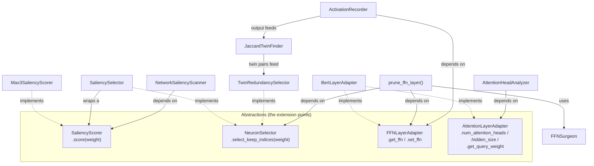

# Knowledge Transfer: `transformer_pruning`

Audience: a developer/researcher picking up this codebase for the first time —
either to run the existing experiments, extend them with a new pruning
criterion, or port the approach to a new model family.

This document goes deeper than the [README](../README.md): the README sells
the architecture in a paragraph each; this document explains *why* each piece
exists, what it depends on, what breaks if you change it, and how to extend
it safely.

---

## 1. What this project is

This project extends pruning criteria originally developed for CNNs (VGG/
ResNet, in the sibling thesis project `pruning_framwork_v4` — "Pruning and
Quantization Techniques for Deep Neural Network Acceleration", NITK, July
2025) onto transformer models, specifically BERT via HuggingFace
`transformers`.

It explores three independent pruning/redundancy signals:

1. **Max-3 weight saliency** — score each neuron/filter by the sum of its 3
   largest-magnitude incoming weights; prune the lowest scorers. This is the
   CNN criterion from the thesis, generalized to also work on `nn.Linear`
   (BERT's FFN layers).
2. **Attention-head redundancy** — cosine similarity / Lp-distance between
   attention heads' flattened query weights, to find near-duplicate heads
   (exploratory, feeds no automated pruning step yet — output is heatmaps for
   a human to read).
3. **Co-activation ("twin") redundancy** — a criterion *not* in the thesis:
   run real sentences through a trained model, record which FFN neurons fire
   together, and treat neurons with near-identical firing patterns (Jaccard/
   IoU ≥ 0.95) as redundant regardless of what their weights look like.

Criteria 1 and 3 both terminate in the same physical operation: shrinking a
BERT FFN block's `(intermediate, output)` `nn.Linear` pair. That shared
endpoint is what the architecture (Section 4) is built around.

`pruning_framwork_v4` and this repo share a research idea, not code —
different frameworks, different model families, different datasets. Don't go
looking for imports between them.

See `../pruning_framwork_v4/KNOWLEDGE_TRANSFER.md` for the CNN-side thesis
framework: its full pruning-criteria catalog with thesis chapter references,
the two bugs found/fixed there (K-means centroid init, distance-scorer
double-pruning) with from-scratch pure-Python verification code, and the
`config.ini`/Kaggle-validation-run plan.

---

## 2. Repository layout

```
transformer_pruning/
├── pruning_transformer/     # the importable package — all reusable logic
│   ├── __init__.py          # public API surface (what `from pruning_transformer import X` exposes)
│   ├── layers.py            # LayerHandle, LayerKind, discover_layers
│   ├── model_adapter.py     # FFNLayerAdapter, AttentionLayerAdapter, BertLayerAdapter
│   ├── scoring.py           # SaliencyScorer, Max3SaliencyScorer, lowest_scoring
│   ├── network_scanner.py   # NetworkSaliencyScanner
│   ├── head_analysis.py     # AttentionHeadAnalyzer
│   ├── ffn_surgery.py       # FFNSurgeon
│   ├── selectors.py         # NeuronSelector, SaliencySelector, TwinRedundancySelector
│   ├── pruning_workflow.py  # prune_ffn_layer (the orchestration entry point)
│   ├── activation_recording.py  # ActivationRecorder
│   └── redundancy.py        # JaccardTwinFinder
├── experiments/              # 10 runnable scripts, one per exploration stage
│   ├── 01_vgg_saliency_demo.py
│   ├── ...
│   └── 10_twin_neuron_pruning_experiment.py
├── docs/
│   └── KNOWLEDGE_TRANSFER.md  # this file
├── README.md
├── requirements.txt
└── .gitignore
```

Rule of thumb: **`pruning_transformer/` never imports from `experiments/`**,
and every experiment script only imports from `pruning_transformer` (plus
third-party libraries). If you find yourself importing an experiment script
from inside the package, that logic belongs in the package instead.

---

## 3. Environment & running

There is **no GPU/PyTorch on the primary dev machine** for this project (same
constraint as `pruning_framwork_v4`) — these scripts are meant to be run on
Colab/Kaggle, not locally. Don't assume `import torch` will succeed in this
dev environment; if you need to sanity-check pure-Python logic locally
without a real torch install, stub `torch`/`torch.nn` (see the git history of
this repo's session logs for examples of this pattern used during review).

Setup on a machine/notebook that does have PyTorch:

```bash
pip install -r requirements.txt
```

Run any experiment directly:

```bash
python experiments/05_bert_mrpc_full_experiment.py
```

**Status caveat (from the README):** all modules were extracted/cleaned from
an exploratory Colab notebook and have not yet been run end-to-end in *this*
repo's layout — treat printed results as needing a real run before citing
them anywhere. One correctness fix was made during extraction: the original
notebook's twin-finder computed `intersection / (fires_A + fires_B)`, which
is off by a factor vs. true Jaccard/IoU (`intersection / union`, where
`union = fires_A + fires_B - intersection`). `redundancy.py`'s
`JaccardTwinFinder` uses the corrected formula — twin-pair counts will differ
slightly from the original notebook's printed output.

---

## 4. Architecture

The package is built around **four small interfaces** so that adding a new
pruning criterion, a new attention metric, a new prunable layer type, or
support for a new model family never means editing existing scanning,
surgery, or orchestration code.



### The four interfaces

| Interface | File | Contract | Implementations | Consumers |
|---|---|---|---|---|
| `SaliencyScorer` | `scoring.py` | `score(weight) -> Tensor` (one score per output unit) | `Max3SaliencyScorer` | `NetworkSaliencyScanner`, `SaliencySelector` |
| `NeuronSelector` | `selectors.py` | `select_keep_indices(intermediate_weight) -> list` | `SaliencySelector`, `TwinRedundancySelector` | `prune_ffn_layer` |
| `FFNLayerAdapter` | `model_adapter.py` | `get_ffn(layer_idx)`, `set_ffn(layer_idx, intermediate, output)` | `BertLayerAdapter` | `prune_ffn_layer`, `ActivationRecorder` |
| `AttentionLayerAdapter` | `model_adapter.py` | `num_attention_heads`, `hidden_size`, `get_query_weight(layer_idx)` | `BertLayerAdapter` | `AttentionHeadAnalyzer` |

`TransformerLayerAdapter` (also in `model_adapter.py`) is just
`FFNLayerAdapter + AttentionLayerAdapter` combined — a convenience type for
`BertLayerAdapter`, which happens to support both. **New consumers should
depend on whichever single interface they actually need**, not the combined
one — that's the whole point of the split (see Section 4.1).

### 4.1 Why it's shaped this way (SOLID, with concrete pointers)

This codebase was deliberately refactored (across several review passes) to
satisfy SOLID, replacing an earlier version with near-duplicate classes
(`SaliencyPruner`/`UniversalPruner`, `SimilarityScanner`/
`DistributionScanner`, a `CoActivationScanner` that mixed recording with
analysis, etc. — see Section 9 for the full old-name → new-location map).
Concretely, in this codebase:

- **Single Responsibility** — `activation_recording.py` only records which
  neurons fired; `redundancy.py` only decides which fired-together pairs
  count as "twins". The original notebook's `CoActivationScanner` did both,
  so changing the redundancy threshold logic risked also touching the
  recording/hooking mechanics. Now they change independently.
- **Open/Closed** — two concrete examples:
  - `layers.py`'s `discover_layers` recognizes new module types via a
    `LayerKind(name, module_type, name_filter)` passed through `extra_kinds`,
    not via editing an `if/elif` chain. Adding `nn.LayerNorm` support is
    `discover_layers(model, extra_kinds=[LayerKind("layernorm", nn.LayerNorm)])`
    — zero edits to `layers.py`.
  - `head_analysis.py`'s `compute_distance_matrix` looks up the Lp-norm order
    from a `LP_METRICS` dict (`{"manhattan": 1, "euclidean": 2}`) instead of
    an `if metric == "manhattan" else ...` ternary. A third metric is a new
    dict entry; an unrecognized metric raises `ValueError` instead of
    silently defaulting to Euclidean.
- **Liskov Substitution** — `SaliencySelector` and `TwinRedundancySelector`
  are fully interchangeable wherever a `NeuronSelector` is expected;
  `prune_ffn_layer` (`pruning_workflow.py`) never branches on which one it
  got, and never will need to for a third selector either.
- **Interface Segregation** — `model_adapter.py`'s adapter interface used to
  be one fat `TransformerLayerAdapter` with 5 abstract members covering both
  FFN and attention access. It was split into `FFNLayerAdapter` and
  `AttentionLayerAdapter` because no consumer used both halves
  (`prune_ffn_layer`/`ActivationRecorder` only touch FFN; `AttentionHeadAnalyzer`
  only touches attention). A future adapter for a model that only supports
  FFN-style pruning now implements `FFNLayerAdapter` alone, without being
  forced to stub out query-weight/head-count methods it has no use for.
- **Dependency Inversion** — `prune_ffn_layer`, `AttentionHeadAnalyzer`, and
  `ActivationRecorder` used to reach directly into
  `model.encoder.layer[i].intermediate.dense` / `...attention.self.query...`
  — i.e., high-level orchestration depended on one concrete HuggingFace
  model's attribute layout. They now depend on the adapter interfaces
  instead; `BertLayerAdapter` is the only implementation, but a differently
  shaped architecture (say, a model that nests its FFN differently) is a new
  adapter class, not an edit to three separate consumers.

### 4.2 What's *not* abstracted, on purpose

Not every class has an interface, and that's intentional — don't "fix" these
without a concrete reason:

- **`FFNSurgeon`** (`ffn_surgery.py`) is a concrete class, not an ABC with
  multiple implementations. There is exactly one correct way to physically
  resize a `(intermediate, output)` Linear pair given `keep_indices` — it's
  a mechanical operation, not a policy decision, so there's nothing to swap.
- **`AttentionHeadAnalyzer`** bundles cosine similarity *and* Lp-distance in
  one class rather than two, because both share the same `get_flat_heads`
  extraction step; splitting them would mean either duplicating that
  extraction or introducing a shared base class for two methods — not worth
  it for two closely related, rarely-changing computations.
- **BERT-only model coverage**: only `BertLayerAdapter` exists. The interface
  split (4.1) makes adding a second adapter (e.g. for a model with a
  differently-shaped FFN block) straightforward *if and when* one is
  actually needed — don't pre-build a `DistilBertLayerAdapter` speculatively.

---

## 5. Module-by-module reference

### `layers.py`
- `LayerHandle(name, module, kind)` — a dataclass wrapping a discovered
  module with its qualified name and a `kind` tag (`"conv2d"`, `"linear"`,
  or whatever a custom `LayerKind` names it).
- `LayerKind(name, module_type, name_filter=None)` — a frozen dataclass
  describing one recognizable module type. `name_filter`, if set, requires
  the module's qualified name to contain that substring (used to isolate
  BERT's `intermediate` FFN-expansion Linears from all other Linears).
- `discover_layers(model, include_conv=True, include_linear=False, linear_name_filter=None, extra_kinds=())`
  — walks `model.named_modules()` and returns matching `LayerHandle`s. The
  built-in conv/linear kinds are gated by `include_conv`/`include_linear`;
  anything else goes through `extra_kinds`.

### `model_adapter.py`
- `FFNLayerAdapter` (ABC) — `get_ffn(layer_idx) -> (intermediate, output)`,
  `set_ffn(layer_idx, intermediate, output) -> None`.
- `AttentionLayerAdapter` (ABC) — `num_attention_heads` (property),
  `hidden_size` (property), `get_query_weight(layer_idx)`.
- `TransformerLayerAdapter` — `FFNLayerAdapter + AttentionLayerAdapter`,
  nothing added on top. Only exists so `BertLayerAdapter` has one type name
  to inherit that satisfies both.
- `BertLayerAdapter(model)` — the only concrete adapter. Assumes
  `model.encoder.layer[i]` layout (HuggingFace `BertModel`; also correct for
  `RobertaModel`, which shares that layout).

### `scoring.py`
- `SaliencyScorer` (ABC) — `score(weight) -> Tensor`, one score per output
  unit (`weight.shape[0]`).
- `Max3SaliencyScorer` — sums each unit's 3 largest-magnitude incoming
  weights. Handles both 4D conv weights (`out_ch, in_ch, kh, kw`, summed
  across `in_ch` and kernel position) and 2D linear weights (`out, in`,
  summed across `in`) via `weight.dim()` branching.
- `lowest_scoring(scorer, weight, amount)` — convenience free function: the
  `amount` lowest-scoring unit indices + their scores, as `[index, score]`
  pairs. Used for one-off single-layer lookups (see `experiments/01`).

### `network_scanner.py`
- `NetworkSaliencyScanner(layers, scorer)` — takes a list of `LayerHandle`
  and a `SaliencyScorer` as constructor dependencies (this is the DIP
  example: the *same* class handles a pure-CNN pass over VGG16 and a mixed
  Conv2d+Linear pass over BERT, just by being handed a different `layers`
  list — see `experiments/02` vs `experiments/03`).
  - `.scan()` → a `pandas.DataFrame` with one row per layer: Layer, Type,
    Units, Avg/Min/StdDev score.
  - `.weakest_units(layer_name, n=5)` → the `n` lowest-scoring unit indices
    for one named layer.

### `head_analysis.py`
- `LP_METRICS = {"manhattan": 1, "euclidean": 2}` — module-level dict, the
  OCP extension point for distance metrics.
- `AttentionHeadAnalyzer(model=None, adapter=None)` — pass either a raw
  HuggingFace model (wrapped in `BertLayerAdapter` automatically) or a
  pre-built `AttentionLayerAdapter`. Raises `ValueError` if neither is given.
  - `.get_flat_heads(layer_idx)` → `(num_heads, head_dim * hidden_size / num_heads)`-shaped tensor of each head's flattened query weights.
  - `.compute_similarity(layer_idx)` → cosine similarity matrix (heads
    unit-normalized first).
  - `.compute_distance_matrix(layer_idx, metric="manhattan", normalize=False)`
    → Lp-distance matrix; `normalize=True` unit-normalizes heads first to
    isolate directional (vs. magnitude) redundancy. Raises `ValueError` on
    an unrecognized `metric`.

### `ffn_surgery.py`
- `FFNSurgeon.resize(intermediate, output, keep_indices)` — builds fresh
  `nn.Linear` modules with only `keep_indices` rows/columns kept, copies
  weights/biases under `torch.no_grad()`, moves the new modules to the
  original device, returns `(new_intermediate, new_output)`. **Does not
  mutate the model in place** — the caller (`prune_ffn_layer`) is
  responsible for re-attaching the returned modules via the adapter.
  **No bounds-checking** on `keep_indices` — passing an out-of-range index
  will raise from the underlying tensor indexing, not from this function;
  that's intentional (validation lives with whoever produces the indices,
  i.e. the selector), but worth knowing if you're debugging an `IndexError`
  here.

### `selectors.py`
- `NeuronSelector` (ABC) — `select_keep_indices(intermediate_weight) -> list`.
- `SaliencySelector(scorer, prune_percent)` — keeps the top
  `(100 - prune_percent)%` scoring neurons under the given `SaliencyScorer`.
- `TwinRedundancySelector(twin_pairs)` — drops the higher-indexed neuron of
  every `(a, b, similarity)` twin tuple. **Ignores the `intermediate_weight`
  argument's values entirely** (only reads its shape) — this is correct, not
  a bug: the redundancy signal here is behavioral (from `JaccardTwinFinder`),
  not weight-based, but the method still accepts the same argument shape as
  `SaliencySelector` to stay substitutable (LSP).

### `pruning_workflow.py`
- `prune_ffn_layer(model, layer_index, selector, surgeon=None, adapter=None)`
  — the single orchestration entry point. Defaults `surgeon` to a fresh
  `FFNSurgeon()` and `adapter` to `BertLayerAdapter(model)` if not given.
  Returns the number of neurons kept. This is the **only** place a
  `NeuronSelector` and `FFNSurgeon` meet — if you're adding a new pruning
  criterion, you should never need to touch this function, only add a new
  `NeuronSelector`.

### `activation_recording.py`
- `ActivationRecorder(model, tokenizer, adapter=None)` — registers a forward
  hook on the target layer's FFN intermediate module (via
  `adapter.get_ffn(layer_idx)[0]`), runs each input text through the model
  one at a time, records `(output > 0).float()` (ReLU-fired mask) per
  example, and returns the concatenated tensor. The hook is always removed
  in a `finally` block, and internal state (`_activations`) is reset after
  every call — **not thread-safe / not reentrant**, but `record()` can be
  called repeatedly on the same instance for different layers.

### `redundancy.py`
- `JaccardTwinFinder.find(fires, threshold=0.95)` — takes the tensor
  `ActivationRecorder.record()` produces (`[num_examples, num_neurons]`
  binary fire mask), computes pairwise true Jaccard/IoU
  (`intersection / union`, not the notebook's original off-by-factor
  formula — see Section 3), and returns `(twins, dead)`:
  - `twins`: list of `(i, j, jaccard_score)` for pairs with `jaccard >= threshold` and `i < j`, excluding pairs where both neurons never fired.
  - `dead`: neuron indices that never fired at all (jaccard undefined,
    handled via the `union == 0 → 1` guard to avoid div-by-zero).

### `__init__.py`
Re-exports the full public API — everything a consumer needs is importable
directly as `from pruning_transformer import X`. If you add a new public
class/function, **add it here too** (both the `from .module import X` line
and the `__all__` entry) — nothing in `experiments/` should ever import from
a submodule path directly.

---

## 6. End-to-end usage patterns

### Max-3 saliency pruning (weight-based)

```python
from pruning_transformer import Max3SaliencyScorer, SaliencySelector, prune_ffn_layer

selector = SaliencySelector(Max3SaliencyScorer(), prune_percent=40)
kept = prune_ffn_layer(model.bert, layer_index=0, selector=selector)
```

### Co-activation twin pruning (behavior-based)

```python
from pruning_transformer import ActivationRecorder, JaccardTwinFinder, TwinRedundancySelector, prune_ffn_layer

recorder = ActivationRecorder(model=model.bert, tokenizer=tokenizer)
fires = recorder.record(texts, layer_idx=0)
twins, dead = JaccardTwinFinder().find(fires, threshold=0.95)
kept = prune_ffn_layer(model.bert, layer_index=0, selector=TwinRedundancySelector(twins))
```

Note both flows call the *exact same* `prune_ffn_layer` — the only thing
that changes is which `NeuronSelector` is constructed. This is the payoff of
the OCP/LSP design: adding a third criterion means writing a third
`NeuronSelector` subclass, never touching `prune_ffn_layer` or `FFNSurgeon`.

### Scanning a whole network (VGG or BERT)

```python
from pruning_transformer import discover_layers, Max3SaliencyScorer, NetworkSaliencyScanner

# VGG: conv layers only
layers = discover_layers(vgg_model, include_conv=True, include_linear=False)
# BERT: FFN-expansion Linears only
layers = discover_layers(bert_model, include_conv=False, include_linear=True, linear_name_filter="intermediate")

scanner = NetworkSaliencyScanner(layers, Max3SaliencyScorer())
report = scanner.scan()          # pandas DataFrame
weakest = scanner.weakest_units("features.24", n=5)
```

### Attention-head redundancy

```python
from pruning_transformer import AttentionHeadAnalyzer

analyzer = AttentionHeadAnalyzer(model)   # BertLayerAdapter built automatically
sim = analyzer.compute_similarity(layer_idx=10)
dist = analyzer.compute_distance_matrix(layer_idx=10, metric="manhattan", normalize=True)
```

### Targeting a non-BERT model (extension example)

```python
from pruning_transformer import FFNLayerAdapter, prune_ffn_layer

class MyModelAdapter(FFNLayerAdapter):
    def get_ffn(self, layer_idx):
        block = my_model.blocks[layer_idx]
        return block.up_proj, block.down_proj

    def set_ffn(self, layer_idx, intermediate, output):
        block = my_model.blocks[layer_idx]
        block.up_proj, block.down_proj = intermediate, output

prune_ffn_layer(my_model, layer_index=0, selector=selector, adapter=MyModelAdapter())
```

No edits to `pruning_workflow.py`, `ffn_surgery.py`, or any selector needed —
this is the DIP payoff from Section 4.1.

---

## 7. Experiments walkthrough

Each script under `experiments/` is a standalone, runnable exploration
stage — narrative order matters (each stage builds conceptually on the last)
but there's no code dependency between them; every script only imports from
`pruning_transformer`.

| # | Script | What it validates | Package pieces exercised |
|---|---|---|---|
| 01 | `01_vgg_saliency_demo.py` | Vectorized Max-3 score on one VGG16 conv layer | `Max3SaliencyScorer`, `lowest_scoring` |
| 02 | `02_vgg_network_scan.py` | Max-3 stats across all of VGG16 | `discover_layers`, `NetworkSaliencyScanner` |
| 03 | `03_bert_universal_scan.py` | Max-3 crossed over onto BERT-tiny's FFN layers | same scanner as 02, different `discover_layers` args |
| 04 | `04_bert_pruning_surgery_demo.py` | Neuron surgery doesn't break a forward pass | `SaliencySelector`, `prune_ffn_layer` |
| 05 | `05_bert_mrpc_full_experiment.py` | Real accuracy: baseline → prune (40%) → heal, on MRPC | full Max-3 pipeline + HF `Trainer` |
| 06 | `06_attention_head_similarity.py` | Cosine similarity between attention heads | `AttentionHeadAnalyzer.compute_similarity` |
| 07 | `07_attention_head_distance.py` | Manhattan vs. Euclidean head distance | `compute_distance_matrix`, both metrics |
| 08 | `08_attention_scaled_distribution.py` | Distance on unit-normalized heads (magnitude removed) | `compute_distance_matrix(..., normalize=True)` |
| 09 | `09_coactivation_twin_scan.py` | Behavior-based twin-neuron detection | `ActivationRecorder`, `JaccardTwinFinder` |
| 10 | `10_twin_neuron_pruning_experiment.py` | Real accuracy: prune twins → heal, on MRPC | full twin pipeline + HF `Trainer` |

Stages 05 and 10 are the two "real experiment" scripts — they fine-tune,
measure damage, and re-heal. Everything else is a faster diagnostic/demo
that doesn't require training.

---

## 8. Extension guide — "how do I…"

**…add a new saliency scoring rule (e.g. SVD-based)?**
Write a new class implementing `SaliencyScorer.score(weight) -> Tensor` in
`scoring.py` (or a new file, then export it from `__init__.py`). It slots
into both `NetworkSaliencyScanner` and `SaliencySelector` with zero other
changes.

**…add a new neuron-selection criterion?**
Write a new class implementing `NeuronSelector.select_keep_indices(weight) -> list`
in `selectors.py`. It slots into `prune_ffn_layer` as-is.

**…prune a new module type (e.g. LayerNorm)?**
Pass `extra_kinds=[LayerKind("layernorm", nn.LayerNorm)]` to
`discover_layers` at the call site — no changes to `layers.py`.

**…add a new attention distance metric?**
Add an entry to `LP_METRICS` in `head_analysis.py` (only works for Lp-norms;
a fundamentally different metric, e.g. cosine distance as a *distance* rather
than similarity, would need a small refactor of `compute_distance_matrix`
beyond the dict lookup).

**…support a new model family (e.g. DistilBERT, a custom architecture)?**
Write a new class implementing `FFNLayerAdapter` and/or
`AttentionLayerAdapter` (only implement the one(s) you actually need — see
Section 6's example). Pass an instance via the `adapter=` parameter to
`prune_ffn_layer`, `AttentionHeadAnalyzer`, or `ActivationRecorder`. Don't
touch any of those three files.

**…change how FFN surgery physically works?**
Don't, unless the resize logic itself is wrong. `FFNSurgeon` is deliberately
not an interface — there's one correct way to do this operation (see Section
4.2). If you do need to change it, it's the one place selection strategies
never see, so the blast radius is contained to `ffn_surgery.py` itself.

---

## 9. Lineage: old notebook names → current locations

Useful if you're cross-referencing the original exploratory Colab notebook,
older commits, or the thesis framework's naming:

| Old / notebook name | Current location |
|---|---|
| `compute_saliency_score_channel_vectorized` | `scoring.Max3SaliencyScorer` + `scoring.lowest_scoring` |
| `SaliencyPruner` (VGG-only) | `network_scanner.NetworkSaliencyScanner` (generalized) |
| `UniversalPruner` (VGG+BERT) | `network_scanner.NetworkSaliencyScanner` (same class, different `discover_layers` args) |
| `PruningSurgeon` | `ffn_surgery.FFNSurgeon` + `pruning_workflow.prune_ffn_layer` |
| `SimilarityScanner` | `head_analysis.AttentionHeadAnalyzer.compute_similarity` |
| `DistributionScanner` | `head_analysis.AttentionHeadAnalyzer.compute_distance_matrix` |
| `CoActivationScanner` | split into `activation_recording.ActivationRecorder` (recording) + `redundancy.JaccardTwinFinder` (analysis) |
| `TwinSurgeon` | `selectors.TwinRedundancySelector` + `pruning_workflow.prune_ffn_layer` |
| `attention_similarity.py` (early module name) | `head_analysis.py` |
| `co_activation.py` (early module name) | split into `activation_recording.py` + `redundancy.py` |
| `surgeon.py` (early module name) | `ffn_surgery.py` |
| `cnn_saliency.py` / `universal_saliency.py` (early module names) | merged into `scoring.py` + `network_scanner.py` |

---

## 10. Known issues / gotchas checklist

- **Nothing has been run end-to-end in this repo layout yet** (see Section
  3). Before citing any accuracy number, actually run the corresponding
  `experiments/05` or `experiments/10` script.
- **No GPU/torch locally** — don't try to `import torch` or run experiments
  on the primary dev machine; use Colab/Kaggle.
- **`FFNSurgeon.resize` has no index validation** — an invalid `keep_indices`
  list will surface as a raw tensor-indexing error, not a friendly message.
  If you see a confusing `IndexError` from surgery, check the selector that
  produced the indices first.
- **`ActivationRecorder` is not reentrant** — don't call `.record()`
  concurrently on the same instance from multiple threads; sequential reuse
  (same instance, different `layer_idx`, one call at a time) is fine.
- **`TwinRedundancySelector` ignores the neuron weights** it's handed — this
  is correct behavior (the signal is behavioral), not a bug, but it can look
  surprising in a debugger.
- **`BertLayerAdapter` also covers RoBERTa** (same `encoder.layer[i]`
  layout) but nothing else — don't assume it works for GPT-style or T5-style
  models without checking the actual attribute layout first.

---

## 11. Where to go next

- Read `README.md` for the shorter/marketing-level architecture summary.
- Read the module docstrings — every file in `pruning_transformer/` has a
  top-of-file docstring explaining *why* it's shaped the way it is, written
  for exactly this kind of handoff.
- Run `experiments/04` first if you want the fastest possible sanity check
  that the whole pruning pipeline works end-to-end (no training required,
  just a forward-pass check).
